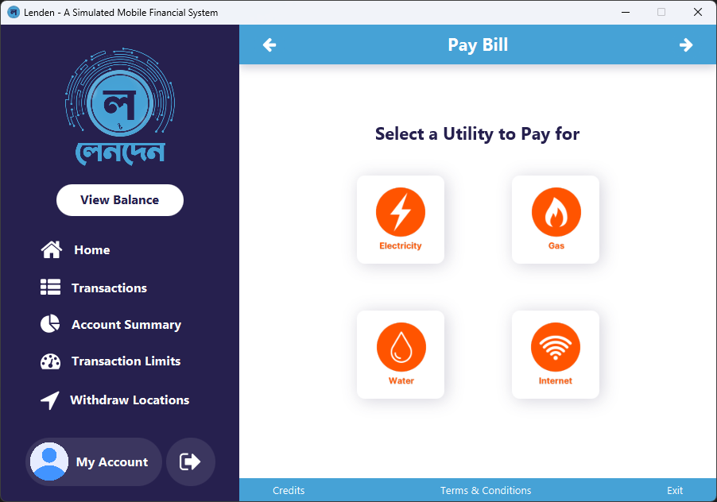

# Project Lenden

  
  

Lenden is a simulated Mobile Financial System (MFS) desktop application, developed in JavaFX for a CSE215 Java course project. It provides a comprehensive platform for financial management and transactions, utilizing key OOP concepts like encapsulation, inheritance, polymorphism, and abstraction to ensure code modularity and maintainability. The intuitive GUI enhances user experience by enabling smooth navigation and usability. Additionally, the project incorporates file operations to securely store user information, transactions, and settings.

## Table of Contents

- [Installation](#installation)
- [Requirements](#requirements)
- [Project Details](#project-details)
- [Features](#features)
- [Screenshots](#screenshots)

## Installation

- Download the installer: [LendenSetup-1.0.0.exe](https://google.com)
- Run the installer and follow the on-screen instructions.

## Requirements

**Operating System:** Windows 7 or above (supports both 32-bit and 64-bit systems).

**Storage:** Requires at least 330 MB of free space.

Note: The high space requirement is due to the setup also installing Java (JRE) required for running the application.

## Project Details

- **Project Group**: Group 2 (404 Not Found)
- **Course:** CSE215L (Section 7)
- **Semester:** Spring 2024 (North South University)
- **Lab Instructor:** Kazi Tanvir Akter
- **Faculty:** Dr. Mohammad Shifat-E-Rabbi (MSRb)

  ### Group Members

  |           Name           |   NSU ID   |               Email               |
  | :----------------------: | :--------: | :-------------------------------: |
  |       Aminul Islam       | 2321169042 |  aminul.islam.232@northsouth.edu  |
  | Naylah Hassan Chowdhury  | 2311531042 |  naylah.chowdhury@northsouth.edu  |
  | Md. Shahriar Rakib Rabbi | 2321937642 | shahriar.rabbi.232@northsouth.edu |
  |     Ahnaf Akib Ahmed     | 2312304642 |   ahnaf.ahmed09@northsouth.edu    |

## Features

- **User Registration:** Create and manage user accounts.
- **Account Management:** View and update account details.
- **Fund Transfer:** Transfer money between accounts.
- **Mobile Top-up:** Recharge mobile credit.
- **Bill Payment:** Pay various utility bills.
- **Merchant Payments:** Make payments to merchants.
- **Cash Withdrawal:** Withdraw cash from the account.
- **Ticket Booking:** Book tickets for various modes of transport.
- **Transaction History:** View past transactions.
- **Calculators:** Use financial calculators for interest and percentages.

## Screenshots

Some screenshots of the key features and app interface:

### User Authentication

|        Login Screen        |       Registration Screen        |
| :------------------------: | :------------------------------: |
|  |  |

### Dashboard

### Account Management

|                  Transaction History                   |                Account Summary                 |
| :----------------------------------------------------: | :--------------------------------------------: |
|  |  |
|                 **Transaction Limits**                 |              **Account Details**               |
|    |            |

### Add Money

|                 Add Money Options                  |               Add Money form - Card                |
| :------------------------------------------------: | :------------------------------------------------: |
|  |        |
|             **Add Money form - Bank**              |              **Add Money - Success**               |
|        |  |

### Pay Bills

|                 Pay Bill Options                 |                  Pay Bill - Electricity                  |
| :----------------------------------------------: | :------------------------------------------------------: |
|  |  |

### Mobile Top-up

|           Mobile Top-up Options            |                  Mobile Top-up - Success                   |
| :----------------------------------------: | :--------------------------------------------------------: |
|  |  |

### Book Tickets

|                   Book Tickets Options                   |                 Book Tickets - Train                 |
| :------------------------------------------------------: | :--------------------------------------------------: |
|  |  |

### Make Payment

|            Make Payment Form             |                  Make Payment - Success                  |
| :--------------------------------------: | :------------------------------------------------------: |
|  |  |

### Withdraw Cash

|                  Withdraw Locations                  |               Withdraw Cash                |
| :--------------------------------------------------: | :----------------------------------------: |
|  |  |

### Calculators

|            Basic Calculator            |                   Percentage Calculators                   |                  Interest Calculators                  |
| :------------------------------------: | :--------------------------------------------------------: | :----------------------------------------------------: |
|  |  |  |

### Send Money to Bank or other Users

|             Lenden to Bank form              |           Send Money form            |
| :------------------------------------------: | :----------------------------------: |
|  |  |
